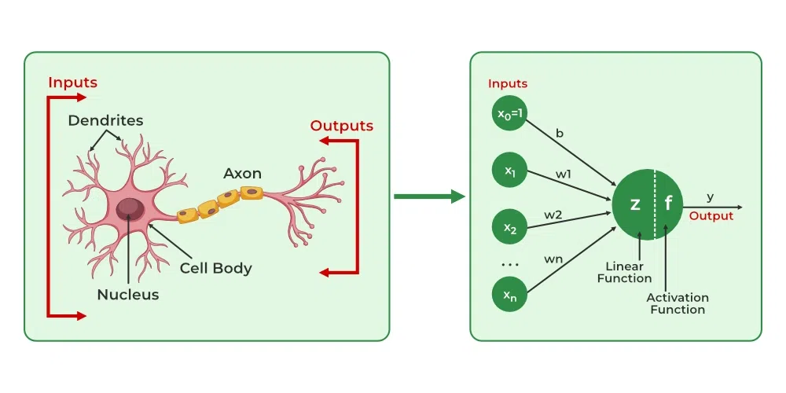

# Day 4 - Perceptron Trick & Training a Perceptron

## Introduction

The Perceptron is one of the earliest supervised learning algorithms used for binary classification.

Today, modern Deep Learning models are far more advanced, but the core idea of learning through weight updates still originates from perceptron learning.

This chapter focuses on:
- Perceptron Trick
- Training Process
- Weight Updates
- Decision Boundary
- Learning Algorithm
- Neuron vs Perceptron Comparison

---

# What is the Perceptron Trick?

The Perceptron Trick is the process of adjusting weights and bias whenever the model makes incorrect predictions.

Goal:
- Move the decision boundary closer to correct classification.

The perceptron learns by:
1. Predicting output
2. Comparing with actual output
3. Updating weights if prediction is wrong

This iterative learning process forms the basis of neural network training.

---

# Mathematical Representation

The perceptron output is calculated as:

:contentReference[oaicite:0]{index=0}

After computing `z`, an activation function is applied.

---

# Step Activation Function

Classic perceptrons use a threshold-based activation.

```text
If z ≥ 0 → Output = 1
If z < 0 → Output = 0
```

---

# Decision Boundary

The perceptron creates a linear decision boundary:

:contentReference[oaicite:1]{index=1}

This boundary separates classes into:
- Positive Class
- Negative Class

---

# How Does the Perceptron Learn?

The perceptron updates weights whenever prediction is incorrect.

Training continues until:
- all points are classified correctly,
OR
- maximum iterations are reached.

---

# Perceptron Learning Rule

Weights are updated using:

:contentReference[oaicite:2]{index=2}

Bias update:

:contentReference[oaicite:3]{index=3}

Where:
- `η` = learning rate
- `y_true` = actual output
- `y_pred` = predicted output

---

# Why Weight Updates Matter?

Weights determine:
- importance of features,
- influence of inputs,
- shape of decision boundary.

Training improves weights gradually to reduce classification errors.

---

# Step-by-Step Training Process

## Step 1 - Initialize Weights

Weights are usually initialized:
- randomly,
OR
- with small values.

Example:

```python
w1 = 0.2
w2 = -0.1
b = 0
```

---

# Step 2 - Take Input

Example:

```python
x1 = 2
x2 = 3
```

---

# Step 3 - Compute Weighted Sum

Calculate:

:contentReference[oaicite:4]{index=4}

---

# Step 4 - Apply Activation Function

Output becomes:
- 1
OR
- 0

depending on threshold.

---

# Step 5 - Calculate Error

```text
Error = Actual Output - Predicted Output
```

---

# Step 6 - Update Weights

If prediction is wrong:
- update weights,
- shift decision boundary,
- improve classification.

---

# Epoch in Perceptron Training

An Epoch means:
- one complete pass through the entire training dataset.

Training usually requires multiple epochs.

---

# Learning Rate

Learning Rate controls:
- speed of learning.

Too small:
- training becomes slow.

Too large:
- unstable learning.

Typical values:
- 0.01
- 0.001
- 0.1

---

# Linear Separability

Perceptrons only work when data is linearly separable.

## Linearly Separable Data

Classes can be divided using a straight line.

Example:
- AND Gate
- OR Gate

---

# Non-Linearly Separable Data

Cannot be separated using a straight line.

Example:
- XOR Gate

This limitation led to development of:
- Multi-Layer Perceptrons (MLP).

---

# XOR Problem

The XOR problem became one of the biggest limitations of single-layer perceptrons.

Perceptrons fail because:
- XOR requires non-linear boundaries.

This motivated research into:
- hidden layers,
- backpropagation,
- deep neural networks.

---

# Neuron vs Perceptron

## Similarity

Both:
- receive inputs,
- apply weights,
- generate outputs.

A perceptron is actually a basic type of artificial neuron.

---

# Key Difference

Modern neurons:
- use differentiable activation functions,
- support backpropagation,
- learn complex non-linear relationships.

Perceptrons:
- mainly use step activation,
- solve only linear problems.

---

# Diagram - Neuron vs Perceptron

```text
--------------------------------------------------------
|                 PERCEPTRON                           |
--------------------------------------------------------
 Inputs → Weighted Sum → Step Function → Binary Output
             |
             └── Linear Classification Only

--------------------------------------------------------
|              MODERN ARTIFICIAL NEURON               |
--------------------------------------------------------
 Inputs → Weighted Sum → ReLU/Sigmoid → Continuous Output
             |
             └── Supports Deep Learning & Backpropagation
```

---

# Comparison Table

| Feature | Perceptron | Modern Neuron |
|---------|-------------|----------------|
| Activation Function | Step Function | ReLU, Sigmoid, Tanh |
| Problem Type | Linear | Linear + Non-linear |
| Learning Capability | Limited | Advanced |
| Backpropagation | Not suitable | Fully supported |
| Used In | Basic classifiers | Deep Neural Networks |

---

# Why Step Function Became Outdated?

The Step Function is:
- non-differentiable,
- unsuitable for gradient-based optimization.

Modern Deep Learning requires differentiable functions for:
- backpropagation,
- gradient descent.

This led to:
- ReLU
- Sigmoid
- Tanh activation functions.

---

# Gradient Descent Connection

Although perceptrons use simple update rules, modern neural networks use optimization algorithms like:
- Gradient Descent
- Stochastic Gradient Descent (SGD)
- Adam Optimizer

Perceptron learning inspired these methods.

---

# Real World Applications

Perceptron concepts are used in:
- Spam Detection
- Binary Classification
- Pattern Recognition
- Fraud Detection
- Medical Diagnosis

Modern neural networks extend these ideas to:
- Computer Vision
- NLP
- Generative AI

---

# Industry Relevance

Understanding perceptrons is important because they form the mathematical foundation of:
- Artificial Neural Networks
- Deep Learning
- Transformers
- Large Language Models (LLMs)

Even modern AI systems still rely on:
- weighted computations,
- activation functions,
- optimization.

---

# Simple NumPy Implementation

```python
import numpy as np

# Inputs
x = np.array([2, 3])

# Weights
w = np.array([0.5, 0.8])

# Bias
b = 1

# Weighted Sum
z = np.dot(x, w) + b

# Step Activation
output = 1 if z >= 0 else 0

print("Output:", output)
```

---

# Advantages of Perceptron

- Simple and fast
- Easy to understand
- Foundation of neural networks
- Useful for binary classification

---

# Limitations of Perceptron

- Cannot solve XOR problem
- Supports only linear classification
- Uses outdated activation function
- Limited learning capability

---

# Important Terms

| Term | Meaning |
|------|----------|
| Weight | Importance of input |
| Bias | Additional trainable parameter |
| Epoch | One complete training cycle |
| Learning Rate | Speed of learning |
| Activation Function | Adds non-linearity |
| Decision Boundary | Separates classes |

---

# Interview Questions

## Q1. What is the perceptron trick?
The process of updating weights and bias whenever predictions are incorrect.

## Q2. Why can't perceptrons solve XOR?
Because XOR is not linearly separable.

## Q3. Why are modern neurons better?
They use differentiable activation functions and support deep learning.

## Q4. What is a decision boundary?
A line or surface that separates classes.

---

# Key Points Learned Today

✅ Learned the perceptron trick  
✅ Understood perceptron training process  
✅ Learned weight update rules  
✅ Understood decision boundary  
✅ Learned linear separability  
✅ Compared neuron vs perceptron  
✅ Learned limitations of perceptrons  
✅ Connected perceptrons with modern deep learning

---

# Mini Summary

The perceptron introduced the idea of machine learning through weight updates and classification boundaries. Although limited to linear problems, it laid the foundation for modern neural networks and Deep Learning systems used in today's AI industry.

---

# Progress

✅ Completed Day 4 - Perceptron Trick & Training a Perceptron
